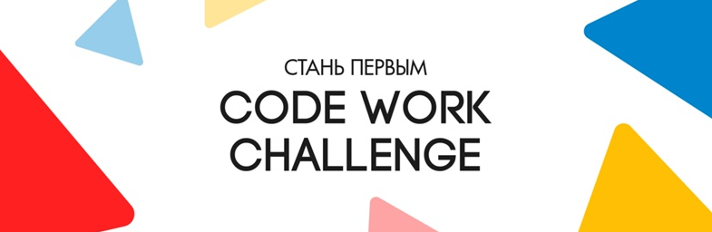
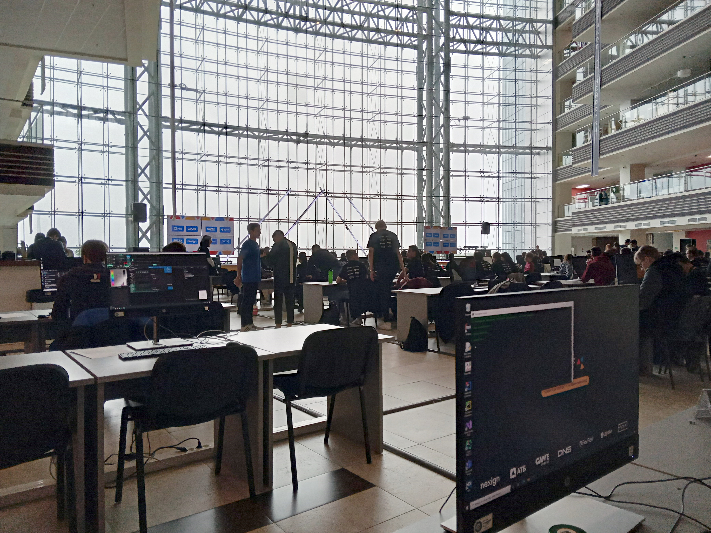
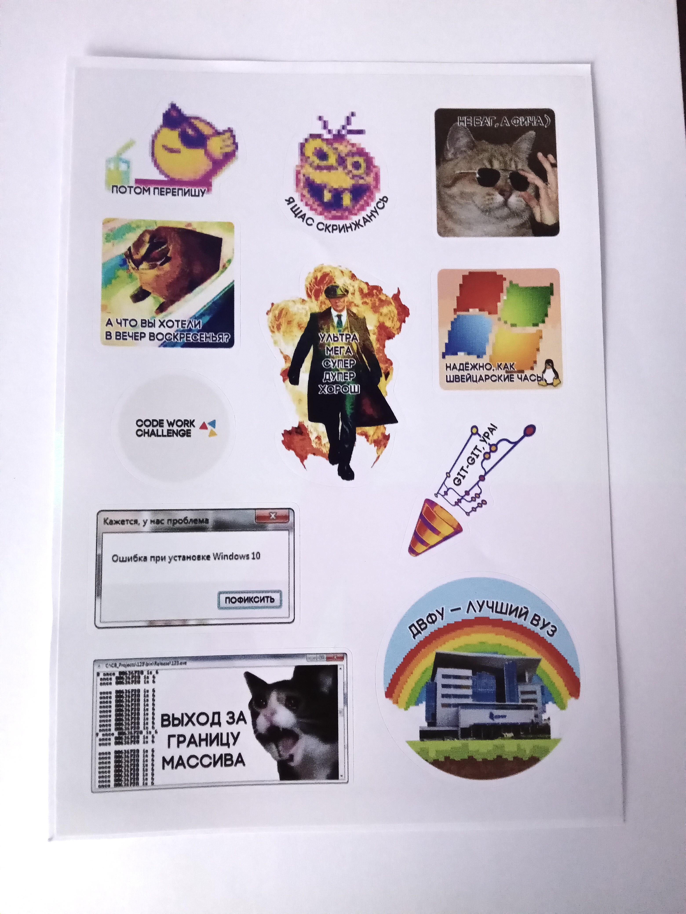
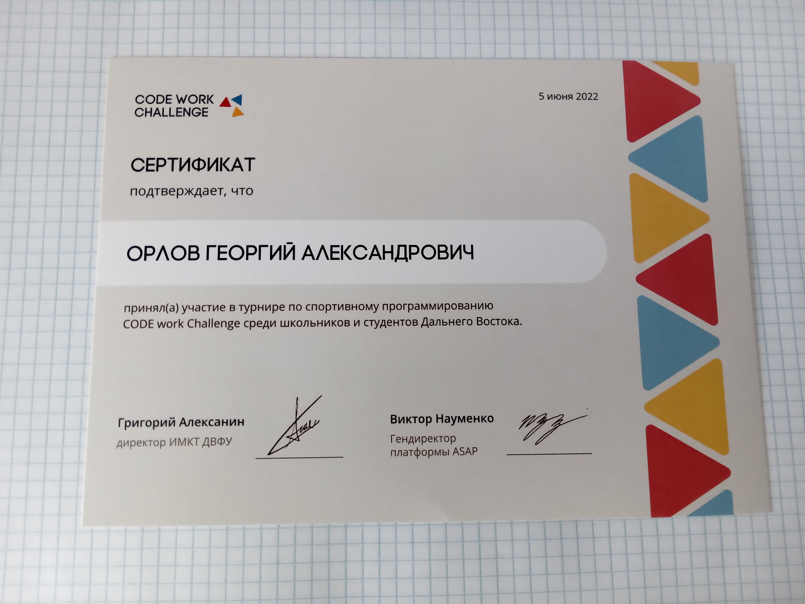

### В 2022 году я принял участие в олимпиаде программистов CodeWork Challenge

Это были интересно и увлекательно. Мы с одногруппниками собрались в команду из 3х человек, и достаточно эффективно и слаженно решали задачи

Всего было 10 разных заданий, и на их решение давалось 6 часов  

Олимпиада проводилась в главном корпусе ДВФУ:

Как мерч выдали наклеечки:

А также сертификат участника:

